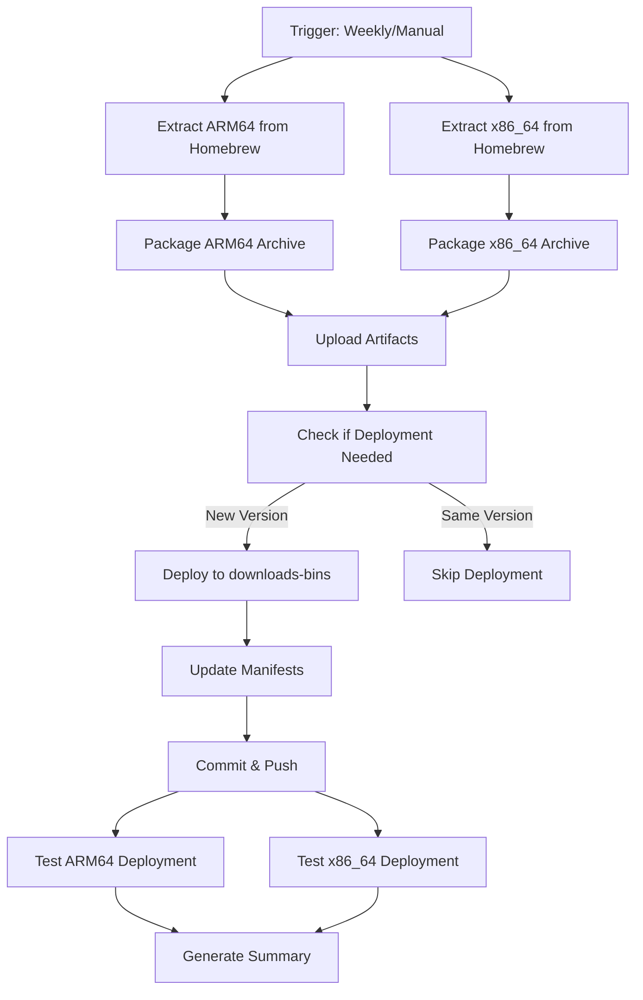

# IWYU Automated Deployment System

## Overview

The IWYU deployment system is **fully automated**. It extracts IWYU binaries from Homebrew, packages them, deploys to downloads-bins, and tests the deployment - all in one workflow.

## Workflow File

`.github/workflows/deploy-iwyu-macos-auto.yml`

## How It Works



## Triggers

### 1. Automatic (Weekly Schedule)

Runs **every Sunday at 2 AM UTC**:
- Checks for Homebrew IWYU updates
- Deploys if new version found
- Skips if version unchanged

### 2. Manual (workflow_dispatch)

Trigger manually from GitHub UI or CLI:
- Useful for immediate deployments
- Can force deployment even if version unchanged
- Can skip tests (not recommended)

## Running the Workflow

### Via GitHub UI

1. Go to: https://github.com/zackees/clang-tool-chain/actions
2. Click: **"Deploy IWYU macOS Binaries (Automated)"**
3. Click: **"Run workflow"** button
4. Select options:
   - **Branch**: Usually `main`
   - **Force deploy**: `false` (only deploy if version changed)
   - **Skip tests**: `false` (always test)
5. Click: **"Run workflow"**

### Via gh CLI

```bash
# Basic run (only deploy if new version)
gh workflow run deploy-iwyu-macos-auto.yml

# Force deployment even if version unchanged
gh workflow run deploy-iwyu-macos-auto.yml \
  -f force_deploy=true

# Skip tests (not recommended)
gh workflow run deploy-iwyu-macos-auto.yml \
  -f skip_tests=true

# Watch the workflow
gh run watch
```

## Workflow Stages

### Stage 1: Extract & Package (Parallel)

**Duration**: ~5-8 minutes per architecture

**Jobs**:
- `extract-and-package (arm64)` on `macos-latest`
- `extract-and-package (x86_64)` on `macos-13`

**What happens**:
1. Install IWYU via Homebrew
2. Extract binaries and support files
3. Copy LLVM dylibs
4. Fix install names (`@executable_path`)
5. Create `.tar.zst` archive
6. Generate SHA256 checksum
7. Upload artifacts

**Outputs**:
- `iwyu-darwin-arm64-{version}/`
  - `iwyu-{version}-darwin-arm64.tar.zst`
  - `iwyu-{version}-darwin-arm64.tar.zst.sha256`
- `iwyu-darwin-x86_64-{version}/`
  - `iwyu-{version}-darwin-x86_64.tar.zst`
  - `iwyu-{version}-darwin-x86_64.tar.zst.sha256`
- `metadata-arm64/deployment-info-arm64.json`
- `metadata-x86_64/deployment-info-x86_64.json`

### Stage 2: Deploy

**Duration**: ~1-2 minutes

**Job**: `deploy` on `ubuntu-latest`

**What happens**:
1. Download artifacts from Stage 1
2. Check current version in downloads-bins manifests
3. **If version unchanged**: Skip deployment (unless forced)
4. **If new version**:
   - Copy archives to downloads-bins repository
   - Update `manifest.json` files with new SHA256 hashes
   - Commit changes
   - Push to `main` branch

**Deployment Decision Logic**:
```python
if current_version == new_version and not force_deploy:
    skip_deployment()
else:
    deploy()
```

### Stage 3: Test Deployment (Parallel)

**Duration**: ~3-5 minutes per architecture

**Jobs**:
- `test-deployment (arm64)` on `macos-latest`
- `test-deployment (x86_64)` on `macos-13`

**What happens**:
1. Wait 60 seconds for GitHub CDN propagation
2. Install clang-tool-chain package
3. Clear IWYU cache
4. Run `clang-tool-chain-iwyu --version` (triggers download)
5. Run full IWYU test suite (`tests/test_iwyu.py`)
6. Report results

**Tests run**:
- ✅ `test_iwyu_version` - Version command works
- ✅ `test_iwyu_analyze_file` - Can analyze C++ files
- ✅ `test_iwyu_on_good_file` - Correct include detection
- ✅ `test_iwyu_with_compile_commands` - Compilation database support

### Stage 4: Summary

**Duration**: <1 minute

**Job**: `summary` on `ubuntu-latest`

**What happens**:
- Generate deployment summary
- Display version, sizes, SHA256 hashes
- Show test results
- Post to GitHub Actions summary page

## Monitoring the Workflow

### Real-time Progress

```bash
# Watch the workflow run
gh run watch

# Or view in browser
# https://github.com/zackees/clang-tool-chain/actions/workflows/deploy-iwyu-macos-auto.yml
```

### Check Status

```bash
# List recent runs
gh run list --workflow=deploy-iwyu-macos-auto.yml --limit 5

# View specific run
gh run view <run-id>

# View logs
gh run view <run-id> --log
```

### Notifications

You'll receive notifications:
- ✅ When deployment succeeds
- ❌ When deployment fails
- 📧 Via email (if enabled in GitHub settings)
- 🔔 Via GitHub mobile app

## Understanding the Results

### Deployment Summary

After the workflow completes, check the **Summary** page:

```
# IWYU Deployment Summary

✅ Status: Deployed
📦 Version: 0.25

## Build Details

### ARM64
{
  "arch": "arm64",
  "version": "0.25",
  "sha256": "abc123...",
  "archive_size_mb": 25,
  "build_date": "2026-01-05T12:00:00Z"
}

### x86_64
{
  "arch": "x86_64",
  "version": "0.25",
  "sha256": "def456...",
  "archive_size_mb": 24,
  "build_date": "2026-01-05T12:00:00Z"
}

## Test Results
✅ All tests passed
```

### Artifacts Available

Even if deployment is skipped, artifacts are retained for 90 days:
- Download from Actions tab
- Use for manual deployment
- Use for debugging

## Troubleshooting

### Workflow Failed: Extract Stage

**Symptoms**: Homebrew installation or extraction fails

**Solutions**:
```bash
# Check Homebrew status
brew info include-what-you-use

# Check if formula exists
brew search iwyu

# Try manual extraction locally
cd downloads-bins/tools
python3 extract_iwyu_from_homebrew.py --arch arm64
```

### Workflow Failed: Deploy Stage

**Symptoms**: Git push fails or permission denied

**Solutions**:
1. Check if `GITHUB_TOKEN` has `contents: write` permission
2. Verify downloads-bins repository exists
3. Check branch protection rules

### Workflow Failed: Test Stage

**Symptoms**: Tests fail after deployment

**Solutions**:
1. Check if CDN propagated (wait longer than 60s)
2. Verify manifest SHA256 matches archive
3. Test manually:
   ```bash
   rm -rf ~/.clang-tool-chain/iwyu
   clang-tool-chain-iwyu --version
   ```

### Deployment Skipped

**Symptoms**: Workflow completes but nothing deployed

**Why**: Current version matches new version

**Solutions**:
- This is normal behavior (no update needed)
- To force deployment:
  ```bash
  gh workflow run deploy-iwyu-macos-auto.yml -f force_deploy=true
  ```

## Manual Intervention

### Download Artifacts Without Deployment

If you want artifacts but not deployment:

```bash
# Run workflow with deployment dry-run (download artifacts manually)
gh workflow run deploy-iwyu-macos-auto.yml

# Wait for completion
gh run watch

# Download artifacts
gh run download <run-id>
```

### Deploy Manually After Download

```bash
# 1. Download artifacts from workflow
gh run download <run-id>

# 2. Navigate to downloads-bins
cd downloads-bins

# 3. Copy archives
cp ../iwyu-darwin-arm64-*/iwyu-*.tar.zst assets/iwyu/darwin/arm64/
cp ../iwyu-darwin-arm64-*/iwyu-*.sha256 assets/iwyu/darwin/arm64/
# ... (repeat for x86_64)

# 4. Update manifests manually
nano assets/iwyu/darwin/arm64/manifest.json
nano assets/iwyu/darwin/x86_64/manifest.json

# 5. Commit and push
git add assets/iwyu/
git commit -m "fix(iwyu): Manual deployment"
git push origin main
```

## Cost Estimation

### Per Run (Both Architectures)

**Compute time**:
- Extract ARM64: ~5 min on `macos-latest` = $0.04
- Extract x86_64: ~5 min on `macos-13` = $0.04
- Deploy: ~2 min on `ubuntu-latest` = $0.001
- Test ARM64: ~4 min on `macos-latest` = $0.03
- Test x86_64: ~4 min on `macos-13` = $0.03

**Total per run**: ~$0.14

### Monthly Cost (Weekly Schedule)

- 4-5 runs per month
- If no updates: Mostly skipped (minimal cost)
- If updates deployed: ~$0.70/month

### Optimization Tips

1. **Schedule wisely**: Weekly checks are usually sufficient
2. **Skip unnecessary runs**: Only run when Homebrew updates
3. **Use caching**: Artifacts retained 90 days
4. **Manual trigger only**: Disable schedule if not needed

## Best Practices

### ✅ Do

- Let the workflow run automatically on weekends
- Monitor the first few runs to ensure stability
- Check test results before using new binaries
- Keep artifacts retention at 90 days

### ❌ Don't

- Don't skip tests in production
- Don't force deploy without reason
- Don't modify deployment logic without testing
- Don't run manually every day (expensive)

## Maintenance

### Update Homebrew Formula

If Homebrew changes the IWYU formula:

1. Update `extract_iwyu_from_homebrew.py` if needed
2. Test locally first:
   ```bash
   python3 extract_iwyu_from_homebrew.py --arch arm64
   ```
3. Commit changes
4. Trigger workflow manually to test

### Update IWYU Version Mapping

If LLVM/IWYU version relationship changes:

1. Update `build_iwyu_macos.py`:
   ```python
   IWYU_VERSION_MAP = {
       "21.1.6": "0.25",
       "22.0.0": "0.26",  # Add new mapping
   }
   ```
2. Test locally
3. Commit and push

## Rollback Procedure

### If Deployed Binary Is Broken

```bash
# 1. Go to downloads-bins repository
cd downloads-bins

# 2. Revert to previous commit
git revert HEAD
git push origin main

# 3. Or restore previous manifest manually
git checkout HEAD~1 -- assets/iwyu/darwin/arm64/manifest.json
git checkout HEAD~1 -- assets/iwyu/darwin/x86_64/manifest.json
git commit -m "fix(iwyu): Rollback to previous version"
git push origin main
```

### If Tests Fail

The workflow automatically **prevents deployment** if tests fail:
- Artifacts are uploaded
- Deployment is not performed
- Manual intervention required

## Security Considerations

### Permissions

Workflow needs:
- `contents: write` - To push to downloads-bins
- `GITHUB_TOKEN` with sufficient scope

### Supply Chain

- IWYU from official Homebrew (trusted)
- LLVM from official Homebrew (trusted)
- No third-party downloads
- SHA256 verification at deployment

### Access Control

- Only repository admins can trigger manually
- Scheduled runs use default branch only
- Protected branches prevent unauthorized changes

## Future Enhancements

### Planned

- [ ] Notification system (Slack/Discord)
- [ ] Automatic changelog generation
- [ ] Version bump detection
- [ ] Rollback automation
- [ ] Multi-version support (keep old versions)

### Ideas

- Canary deployments (test on subset first)
- A/B testing between Homebrew and source build
- Automatic issue creation on failure
- Performance benchmarking

## FAQ

**Q: How often does it run?**
A: Weekly on Sundays at 2 AM UTC.

**Q: Does it deploy every run?**
A: Only if Homebrew has a new IWYU version.

**Q: Can I run it manually?**
A: Yes, via GitHub Actions UI or `gh` CLI.

**Q: What if tests fail?**
A: Deployment is blocked. Artifacts available for debugging.

**Q: How long does it take?**
A: ~10-15 minutes total (stages run in parallel).

**Q: Is it expensive?**
A: ~$0.14 per run, ~$0.70/month if running weekly.

**Q: Can I disable automatic runs?**
A: Yes, comment out the `schedule:` section in the workflow.

**Q: What if I want to force deploy?**
A: Use `gh workflow run ... -f force_deploy=true`.

---

**Last Updated**: 2026-01-05
**Workflow**: `.github/workflows/deploy-iwyu-macos-auto.yml`
**Status**: ✅ Ready for Production
